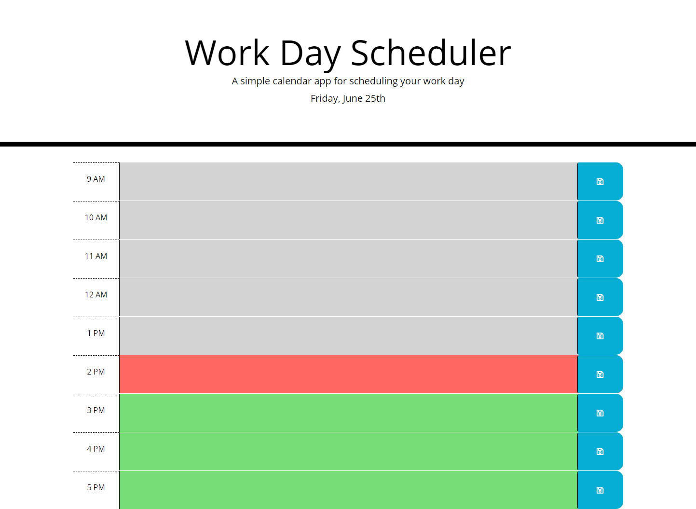

# Work-day-scheduler

## Objective:

Create a calender app that allows the user to save events for each hour of the day.  The app will feature HTML, CSS powered by jQuery.

## Details:

* The current day at the top displays at the top of the calendar. 

* When the user scrolls is presented with timeblocks. The timeblocks will be color coded to indicate wether it is in the past, present, or future.

* When user clicks on timeblock they can type an event and save it by clicking on the 'save' button.

* When 'save' button is clicked the text is saved in the local storage area.

* When page is refreshed the text event remains saved.

--------

https://www.w3schools.com/bootstrap/bootstrap_grid_examples.asp
